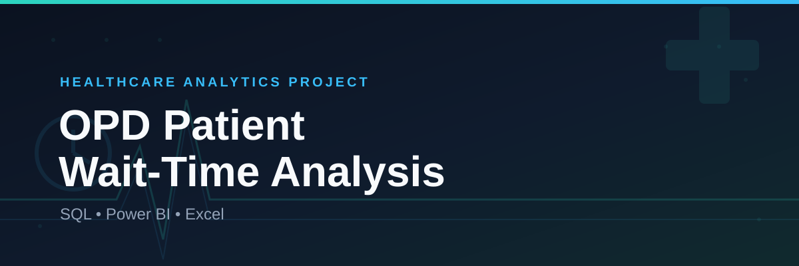

# 🏥 OPD Patient Wait-Time Analysis | SQL & Power BI

Analysis of ** outpatient department (OPD) visit records** to identify the root causes of long patient wait times and support data-driven process improvement in hospital operations.

---

## 📌 Project Overview

Long wait times in hospital OPDs directly affect patient satisfaction and operational efficiency. This project analyzes six months of OPD visit data (Jan–Jun 2024) across **8 departments** and **17 doctors** to answer:

- Which departments and shifts have the longest patient wait times?
- Is the delay caused by registration or by doctors?
- Which doctors contribute most to patient wait time?
- How does patient satisfaction relate to wait time?
- When is the OPD busiest, and how does peak-hour load affect wait time?

The workflow covers the full analytics pipeline: **raw data → SQL analysis → Power BI dashboard.**

---

## 🛠️ Tools & Technologies

| Stage | Tool |
|---|---|
| Data storage & cleaning | Excel |
| Data querying & analysis | MySQL |
| Dashboard & visualization | Power BI |

---

## 📂 Repository Contents

| File | Description |
|---|---|
| `opd_patient_data.(Project).xlsx` | Raw OPD visit dataset (2,549 records) |
| `opd_analysis.sql` | Table creation, data load, and analysis queries |
| `OPD_Efficiency_Dashboard.pbix` | Power BI dashboard file |
| `OPD_Efficiency_Dashboard_pdf` | PDF export of the dashboard |

---

## 📊 Dataset

Each row represents a single patient's OPD visit and includes:

- **Visit details:** patient ID, visit date, day of week, shift, department, doctor
- **Timestamps:** check-in time, doctor entry time, exit time
- **Wait metrics:** registration delay, doctor wait time, total wait time, consultation duration
- **Flags:** peak hour, patient satisfaction, wait bucket, bottleneck source, delay alert

---

## 🔍 SQL Analysis

Using MySQL, the raw CSV was loaded into a structured `opd_visits` table, followed by queries to:

1. **Department × Shift performance** — average wait, doctor wait, and registration delay per department per shift
2. **Doctor-level ranking** — patients seen, average consultation time, and average wait caused per doctor, ranked by delay
3. **Demand & satisfaction patterns** — visit volume and satisfaction rate by day of week and peak/non-peak hour
4. **Root-cause diagnosis** — split of wait time between registration delay vs. doctor delay, by department
5. **Delay alert detection** — flagging all visits with total wait time exceeding 60 minutes

📄 Full queries: [`opd_analysis.sql`](opd_analysis.sql)

---

## 📈 Power BI Dashboard

An interactive dashboard was built to let stakeholders explore wait-time drivers without writing SQL. It includes:

- KPI cards for total visits, average wait time, and satisfaction rate
- Department- and doctor-wise wait time comparison
- Shift-wise and day-wise visit load and wait trends
- Bottleneck breakdown (registration delay vs. doctor delay)
- Filters for department, doctor, shift, and date range

📄 Dashboard file: [`OPD_Efficiency_Dashboard_pdf.pdf`](OPD_Efficiency_Dashboard_pdf.pdf)

---

## 💡 Key Insights

- **27.1%** of all visits (690 out of 2,549) were flagged as **delay alerts** (total wait > 60 minutes).
- **98.1%** of wait time is attributable to **doctor delay**, versus only 1.9% to registration delay — the bottleneck is overwhelmingly doctor-side, not front-desk.
- **General Medicine** has the highest average wait time (65.7 min), followed by Neurology (60.0 min) and Cardiology (54.9 min); **Pediatrics** has the shortest (39.6 min).
- **Evening shift** sees the longest average wait (53.7 min) vs. Afternoon (45.6 min), the shortest.
- **Peak-hour visits** wait significantly longer on average (61.0 min) than non-peak visits (45.2 min).
- **Saturday** is the busiest day (453 visits), closely followed by Thursday (441).
- Overall **patient satisfaction stands at 54.8%**, with satisfaction dropping sharply as wait time increases.
- The top doctors by average patient wait caused are **Dr. Nair, Dr. Patel, and Dr. Singh** — flagged as priority targets for scheduling review.

---

## ✅ Recommendations

- Focus operational improvement efforts on **doctor scheduling and consultation flow**, since registration is not the primary bottleneck.
- Add additional doctor coverage or staggered scheduling during **Evening shifts** and **peak hours**.
- Review appointment slotting for **General Medicine, Neurology, and Cardiology**, the highest-wait departments.
- Investigate scheduling patterns for doctors with consistently high average wait time.

---

## 🚀 How to Reproduce

1. Load `opd_patient_data.(Project).xlsx` (exported as CSV) into MySQL using the schema and `LOAD DATA INFILE` script in `opd_analysis.sql`.
2. Run the analysis queries in the same file to reproduce department, doctor, and root-cause breakdowns.
3. Open `OPD_Efficiency_Dashboard.pbix` in Power BI Desktop to explore the interactive dashboard.

---

